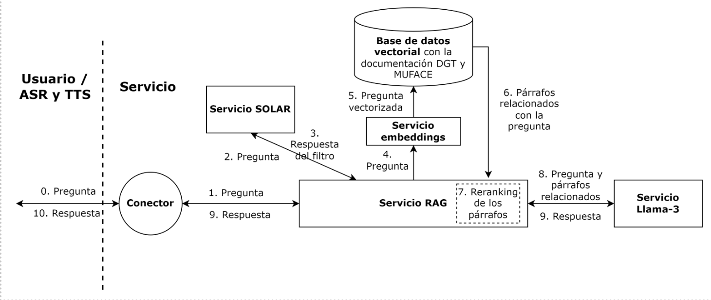
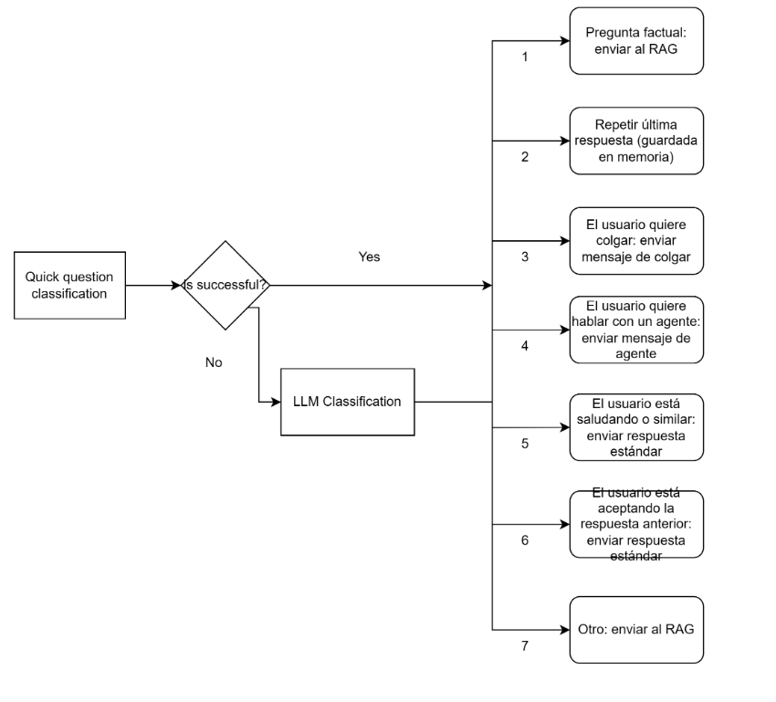
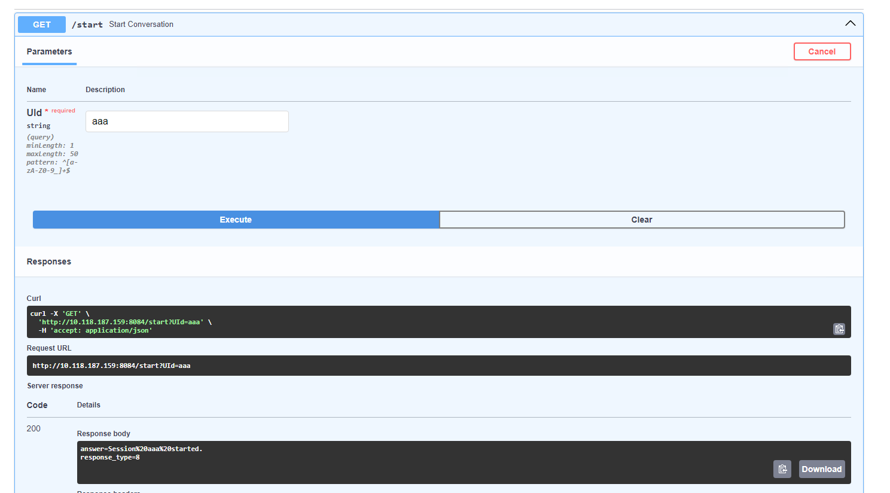
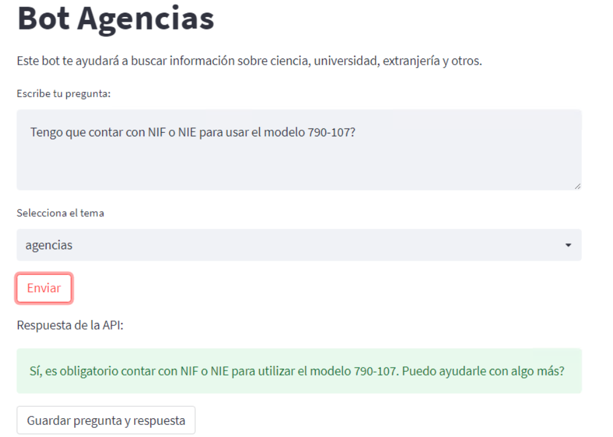

# Replica Azure

**INTRODUCCIÓN:** Microsoft y NTT Data hicieron un RAG con unos documentos de DGT y MUFACE usando ChatGPT y lo pusieron en Azure. A mí me pidieron hacer otro RAG con los mismos documentos de DGT y MUFACE. Está conectado a un servicio telefónico. La parte de teléfono, ASR y TTS la ha hecho Adrián.

[Noelia](noelia.nunez@externos.correo.gob.es ) es la que más sabe de la documentación de este proyecto.

Teléfonos:
- RAG de Microsoft y NTT Data: 919542810
- V0 de nuestro RAG: 910108930
- V1 (actual) del nuestro RAG: 910108905

## Código
- [Repo en lhf-labs, branch main](https://github.com/lhf-labs/rag_muface_dgt)
- [Zip en Gitlab](gitlab-ic.scae.redsara.es/060_lhf/rag_replica_azure)

### Resumen arquitectura 
El servicio de respuestas de DGT y MUFACE se compone de varios bloques, que son: 

- **Conector**: El conector es la parte del servicio que se encarga de recibir las transcripciones de ASR, generar la respuesta y enviarlas de vuelta al TTS. Es el punto de entrada principal. Tiene 3 endpoints: /start (para iniciar una conversación), /process_question (para mandar una pregunta) y /end (para terminar una conversación). 
- **Servicio RAG**: el servicio RAG se encarga de generar una respuesta cuando le llega una pregunta. Contiene a su vez la base de datos vectorial con la documentación de DGT y MUFACE y el modelo de “reranking” que hacen el paso de retrieval. 
- **Servicio SOLAR**: las preguntas que recibe el RAG, pasan por un filtro para determinar si pueden ser respondidas por el sistema; o si por el contrario no están relacionadas con la DGT y con MUFACE. Este servicio tiene el LLM que realiza ese filtro. 
- **Servicio Llama-3**: LLM principal  
- **Servicio de embeddings**: TEI de HuggingFace

En el archivo de configuración `src/config.json` se debe indicar la ruta a: la carpeta con los datos, el servicio llama3, servicio solar, servicio embeddings, y modelo reranker. Ejemplo de JSON:
```json
{
    "DATA_FILE_PATH": "/usr/src/app/src/data",
    "SERVER_LLAMA3": "http://10.118.187.160:8080",
    "SERVER_SOLAR": "http://10.118.187.161:8082",
    "SERVER_EMBEDDINGS": "http://10.118.187.160:8001",
    "RERANKER_MODEL_PATH": "/data/models/rerankers/bge-reranker-large",
    "EMBEDDINGS_MODEL_PATH": "/data/models/embeddings/bge-m3",
    "OPENAI_API_KEY": "sk-xxxxxxxxxxxxxxxxxxxxxxxxxxxxxxxxxxxxxxxx",
    "NUM_RETRIEVES_BM25": "10",
    "NUM_RETRIEVES_EMBEDDING": "10",
    "MAX_TOKENS_MAIN": "300",
    "LOGGING_MODE": "DEBUG"
}

```


**Arquitectura del RAG**




**Arquitectura del conector**




### Despliegue
**Preparación**:
1. Necesitas desplegar los LLMs y Text Embeddings Inference a los que apunta tu archivo de configuración.
```bash
# SOLAR con llamacpp
mkdir -p /data/models
cd /data/models
sudo wget https://huggingface.co/TheBloke/SOLAR-10.7B-Instruct-v1.0-GGUF/resolve/main/solar-10.7b-instruct-v1.0.Q8_0.gguf 
sudo docker run -v /mnt/sdc1/models:/MODELS -p 8082:8082 -e MODEL=solar-10.7b-instruct-v1.0.Q8_0.gguf -e PORT=8082 -e CTX=4096 --privileged --gpus all llamacpp_service # imagen llamacpp de Rafa

# Llama3 con vLLM 
cd /data/models 
git clone https://huggingface.co/meta-llama/Meta-Llama-3-8B-Instruct
cd /home/admin/
git clone https://github.com/lhf-labs/sgad.git # repo sgad del playground 
cd sgad/services/vLLM 
sudo ./deploy_vLLM.sh 0 /data/models/vLLM_models/ /root/.cache/huggingface 8000 vllm/vllm-openai:v0.4.2 NousResearch/Meta-Llama-3-8B-Instruct 

# TEI
mkdir –p /data/models/embeddings 
cd /data/models/embeddings 
git clone https://huggingface.co/BAAI/bge-m3 
docker run -d --privileged --gpus all -p 8001:80 -v /data/models/embeddings/bge-m3/:/model ghcr.io/huggingface/text-embeddings-inference:1.2 --model-id /model 
```

2. Necesitas descargarte el reranker y ponerlo en la ruta que indicas en el archivo de configuración
```bash
mkdir -p /data/models/rerankers 
cd /data/models/rerankers 
git clone https://huggingface.co/BAAI/bge-reranker-large 
```

**Despliegue**: 
Está descrito en el README del repo:
1. Despliegue del RAG (docker): 
```bash
cd rag_muface_dgt

docker build -t rag_muface_dgt_v2 -f core/Dockerfile .

docker run --restart unless-stopped -t --privileged --gpus all \
-v /home/admin/rag_muface_dgt/src/config.json:/usr/src/app/src/config.json \
-v /home/admin/rag_muface_dgt/data:/usr/src/app/src/data \
-v /home/admin/rag_muface_dgt/logs:/usr/src/app/logs \
-v /data/models/rerankers/bge-reranker-large:/data/models/rerankers/bge-reranker-large \
-v /data/models/embeddings/bge-m3:/data/models/embeddings/bge-m3 \
-p 8123:8123 \
-e PORT=8123 rag_muface_dgt_v2
```
Nota: En el archivo de configuración `src/config.json` se debe indicar la ruta a: la carpeta con los datos, el servicio llama3, servicio solar, servicio embeddings, y modelo reranker.

2. Despliegue del conector:
```bash
cd connectors
uvicorn connectors.main:app --host 0.0.0.0 --port 8084
```

### Diagnóstico

**Para probar que el RAG funciona:**

1. Prueba rápida en Python
```python

import requests
data = {"question": "Qué es MUFACE?"}
response = requests.post("http://localhost:8123/query", json=data)
print(response.text)
```

2. Pytest: [script](https://github.com/lhf-labs/rag_muface_dgt/blob/main/tests/test_rag.py)


**Para probar que el conector funciona:**

1. Se puede probar con Fast API: Abrir 10.118.187.159:8084/docs


2. Prueba rápida en Python:
```python
import requests
base_url = "http://localhost:8084"
session_id = "session123"

response = requests.get(f"{base_url}/start", params={"UId": session_id})
print(response.text)

response = requests.get(f"{base_url}/process_question", 
params={"UId": session_id}, "user_question": "Qué es MUFACE?")
print(response.text)

response = requests.get(f"{base_url}/end", params={"UId": session_id})
print(response.text)
```

3. Hay un script para probar rápidamente muchas funcionalidades: [script](https://github.com/lhf-labs/rag_muface_dgt/blob/main/connectors/tests/quick_test.py)

4. Pytest: [script](https://github.com/lhf-labs/rag_muface_dgt/blob/main/connectors/tests/test_connector.py)

## Datos
Los datos nos los pasó JC. Hubo que procesarlos muchas veces según íbamos encontrando fallos, cosas que el LLM no entendía bien, etc. 

- [Datos originales en sharepoint](https://colaboraage-my.sharepoint.com/:f:/r/personal/josecarlos_martinez_correo_gob_es/Documents/Documentaci%C3%B3n%20Servicio%20060/LHF-VF/Doc%20Proyectos%20LHF/Despliegue%20de%20modelo%20convesacional%20vocal%20muface-DGT/Documentos%20maestros?csf=1&web=1&e=Y2hAeA)
- [Datos procesados en gitlab](https://gitlab-ic.scae.redsara.es/060_lhf/rag_replica_azure/-/blob/main/KB_RAG_Azure.csv?ref_type=heads)

## Evaluación
Ha habido muchas rondas de evaluación. Quedan dos rondas finales, una usando Llama-3-8B-Instruct y otra con Llama-3-70B-Instruct.
Link a los Excel con las evaluaciones:
- [Llama-3-8B-Instruct](https://colaboraage-my.sharepoint.com/:x:/r/personal/josecarlos_martinez_correo_gob_es/Documents/Documentaci%C3%B3n%20Servicio%20060/LHF-VF/Doc%20Proyectos%20LHF/Despliegue%20de%20modelo%20convesacional%20vocal%20muface-DGT/Versi%C3%B3n%20LHF/Otros%20documentos/Comparativa_voz_ChatGPT_Llama3%20(v.2)%2020240903.xlsx?d=w410c28a0ebf24146867a4d34c0ac5ecb&csf=1&web=1&e=nIrO9N)
- [Llama-3-70B-Instruct](https://colaboraage-my.sharepoint.com/:x:/r/personal/josecarlos_martinez_correo_gob_es/Documents/Documentaci%C3%B3n%20Servicio%20060/LHF-VF/Doc%20Proyectos%20LHF/Despliegue%20de%20modelo%20convesacional%20vocal%20muface-DGT/Versi%C3%B3n%20LHF/Otros%20documentos/Evaluacion%20voz%2020240925%20Llama70B.xlsx?d=wed70208dab3a461d874e2d7375c7034e&csf=1&web=1&e=yO8s4G)

Además, un resumen de la evaluación que incluye tiempos de latencia está en:
- [una presentación que le hicimos a SGAD](https://colaboraage-my.sharepoint.com/:p:/r/personal/josecarlos_martinez_correo_gob_es/Documents/Documentaci%C3%B3n%20Servicio%20060/LHF-VF/Doc%20Proyectos%20LHF/Despliegue%20de%20modelo%20convesacional%20vocal%20muface-DGT/Versi%C3%B3n%20LHF/Otros%20documentos/Comparativa%20voz%20ChatGPT_Llama3%20-%20an%C3%A1lisis.pptx?d=wfc2ddf558c5c4e97a0cb4814caf4cc98&csf=1&web=1&e=EIFDOY)
- [documentación ENT de SGAD](https://colaboraage-my.sharepoint.com/:w:/r/personal/josecarlos_martinez_correo_gob_es/Documents/Documentaci%C3%B3n%20Servicio%20060/LHF-VF/Doc%20Proyectos%20LHF/Despliegue%20de%20modelo%20convesacional%20vocal%20muface-DGT/Versi%C3%B3n%20LHF/18102024_ENT_Modelo%20Conversacional%20MUFACE-DGT%20v0.docx?d=we5b9feec042245db86b8b071c8981d79&csf=1&web=1&e=7HIlui)


## Documentación 
- [Carpeta en SharePoint](https://colaboraage-my.sharepoint.com/:f:/r/personal/josecarlos_martinez_correo_gob_es/Documents/Documentaci%C3%B3n%20Servicio%20060/LHF-VF/Doc%20Proyectos%20LHF/Despliegue%20de%20modelo%20convesacional%20vocal%20muface-DGT/Versi%C3%B3n%20LHF?csf=1&web=1&e=J9grIl)
- [Documentación de la API en sharepoint](https://colaboraage-my.sharepoint.com/:w:/r/personal/josecarlos_martinez_correo_gob_es/Documents/Documentaci%C3%B3n%20Servicio%20060/LHF-VF/Doc%20Proyectos%20LHF/Despliegue%20de%20modelo%20convesacional%20vocal%20muface-DGT/Versi%C3%B3n%20LHF/Otros%20documentos/Documentaci%C3%B3n%20de%20la%20API%20RAG%20Replica%20Azure.docx?d=wd5e02b04e5e84622af29fcafb36bf0f1&csf=1&web=1&e=qxzdYZ)
- Documentación formal de SGAD: [DST](https://colaboraage-my.sharepoint.com/:w:/r/personal/josecarlos_martinez_correo_gob_es/Documents/Documentaci%C3%B3n%20Servicio%20060/LHF-VF/Doc%20Proyectos%20LHF/Despliegue%20de%20modelo%20convesacional%20vocal%20muface-DGT/Versi%C3%B3n%20LHF/18102024_DST_Modelo%20conversacional%20MUFACE-DGT%20v0.docx?d=we66c0715506c4ad7b7237deafce3a793&csf=1&web=1&e=PLspT9) y [ENT](https://colaboraage-my.sharepoint.com/:w:/r/personal/josecarlos_martinez_correo_gob_es/Documents/Documentaci%C3%B3n%20Servicio%20060/LHF-VF/Doc%20Proyectos%20LHF/Despliegue%20de%20modelo%20convesacional%20vocal%20muface-DGT/Versi%C3%B3n%20LHF/18102024_ENT_Modelo%20Conversacional%20MUFACE-DGT%20v0.docx?d=we5b9feec042245db86b8b071c8981d79&csf=1&web=1&e=7HIlui)
- [Guía de lo que puedes hacer](https://colaboraage-my.sharepoint.com/:w:/r/personal/josecarlos_martinez_correo_gob_es/Documents/Documentaci%C3%B3n%20Servicio%20060/LHF-VF/Doc%20Proyectos%20LHF/Despliegue%20de%20modelo%20convesacional%20vocal%20muface-DGT/Versi%C3%B3n%20LHF/Otros%20documentos/Demo%20guiada%20de%20la%20r%C3%A9plica%20de%20Azure.docx?d=w084033f351764c33bc63e54c955a1d61&csf=1&web=1&e=dWnrMI)
- [Protocolo de evaluación](https://colaboraage-my.sharepoint.com/:w:/r/personal/josecarlos_martinez_correo_gob_es/Documents/Documentaci%C3%B3n%20Servicio%20060/LHF-VF/Doc%20Proyectos%20LHF/Despliegue%20de%20modelo%20convesacional%20vocal%20muface-DGT/Versi%C3%B3n%20LHF/Otros%20documentos/Gu%C3%ADa%20de%20evaluaci%C3%B3n%20del%20sistema%20de%20preguntas%20y%20respuesta%20de%20DGT%20y%20MUFACE.docx?d=w51064ba408c14a55a846b3d0843ecf53&csf=1&web=1&e=etu3kR)

## Uso actual
Actualmente:
- el conector está desplegado en 159:8084 (screen session)
- el docker con el RAG está desplegado en 159:8123 (docker)
- el sistema telefónico de Adrián está apuntando al conector en 159:8084

## Otros
NA


---

# Bot Agencias
**INTRODUCCIÓN:** Cuando un ciudadano llama al 060, un humano te responde a tus dudas. Estos humanos están contratados por dos agencias (Intelcia e Integralia). Estas agencias nos han pasado alguna documentación que usan los humanos para responder a las preguntas y hemos hecho un RAG con esta documentación. 

[Consuelo](ccota@zelenza.com) es la que más sabe de esta documentación.

## Código
- [Repo en lhf-labs, branch bot_agencias](https://github.com/lhf-labs/rag_muface_dgt/tree/bot_agencias)
- [Zip en Gitlab](gitlab-ic.scae.redsara.es/060_lhf/bot_agencias)

### Resumen arquitectura 
El bot agencias se compone de varios bloques, que son: 

- **Conector**: El conector es la parte del servicio que se encarga de recibir las transcripciones de ASR, generar la respuesta y enviarlas de vuelta al TTS. Es el punto de entrada principal. Tiene 3 endpoints: /start (para iniciar una conversación), /process_question (para mandar una pregunta) y /end (para terminar una conversación). 
- **Servicio RAG**: el servicio RAG se encarga de generar una respuesta cuando le llega una pregunta. Contiene a su vez la base de datos vectorial con la documentación de agencias y el modelo de “reranking” que hacen el paso de retrieval. 
- **Servicio Llama-3**: LLM principal  
- **Servicio LLM generación de preguntas**: LLM que genera una pregunta por cada chunk de la base de conocimiento
- **Servicio de embeddings**: TEI de HuggingFace

En el archivo de configuración `src/config.json` se debe indicar la ruta a: la carpeta con los datos, el servicio llama3, servicio LLM generación de preguntas, servicio embeddings, y modelo reranker. Ejemplo de JSON:
```JSON
{
    "DATA_FILE_PATH": "/usr/src/app/src/data",
    "SERVER_LLAMA3": "http://10.118.187.160:8080",
    "SERVER_SOLAR": "http://10.118.187.161:8082", # No se usa
    "SERVER_GEN_QUESTIONS": "http://10.118.187.159:8080",
    "SERVER_EMBEDDINGS": "http://10.118.187.160:8001",
    "RERANKER_MODEL_PATH": "/data/models/rerankers/bge-reranker-large",
    "EMBEDDINGS_MODEL_PATH": "/data/models/embeddings/bge-m3",
    "OPENAI_API_KEY": "sk-xxxxxxxxxxxxxxxxxxxxxxxxxxxxxxxxxxxxxxxx",
    "NUM_RETRIEVES_BM25": "10",
    "NUM_RETRIEVES_EMBEDDING": "10",
    "MAX_TOKENS_MAIN": "300",
    "LOGGING_MODE": "DEBUG"
}


```

#### Flujo del RAG
El flujo del RAG es estándar [(KB, hybrid search, una llamada a una chain sencilla, etc)](https://github.com/lhf-labs/rag_muface_dgt/blob/bot_agencias/core/main.py#L69).

Lo más relevante aquí es que el despliegue es MUY lento. Esto es porque después de hacer el text splitting, [se añaden metadatos a los chunks](https://github.com/lhf-labs/rag_muface_dgt/blob/bot_agencias/core/main.py#L98)). En concreto, se manda cada chunk a un LLM y este genera una pregunta que se pueda responder únicamente con la info que está en el chunk. Se genera una pregunta por chunk y se añade a los metadatos.

#### Flujo del conector
El flujo del conector es este:
0. Llega una pregunta
1. [Preprocesado](https://github.com/lhf-labs/rag_muface_dgt/blob/bot_agencias/connectors/rag_connector_agencias.py#L225)
2. Se comprueba si está en un diccionario de FAQs. 
   1. Si está, [se usa la respuesta guardada en el diccionario de FAQs](https://github.com/lhf-labs/rag_muface_dgt/blob/bot_agencias/connectors/rag_connector_agencias.py#L239). 
   2. Si no está, [se manda a la chain del RAG](https://github.com/lhf-labs/rag_muface_dgt/blob/bot_agencias/connectors/rag_connector_agencias.py#L253)
3. [Se posprocesa la respuesta](https://github.com/lhf-labs/rag_muface_dgt/blob/bot_agencias/connectors/rag_connector_agencias.py#L265). Esto incluye:
   - [Manejar si la respuesta está filtrada](https://github.com/lhf-labs/rag_muface_dgt/blob/bot_agencias/connectors/rag_connector_agencias.py#L370) .Esto no aplica porque el RAG agencias no tiene el filtro de preguntas no relevantes, pero sí se usa en otros RAGs que compartan este conector.
   - [Manejar si hubo un error o está vacía](https://github.com/lhf-labs/rag_muface_dgt/blob/bot_agencias/connectors/rag_connector_agencias.py#L375)
   - [Manejar si la respuesta dice "no tengo información"](https://github.com/lhf-labs/rag_muface_dgt/blob/bot_agencias/connectors/rag_connector_agencias.py#L382). En ese caso, se cogen preguntas relacionadas con los chunks del contexto. Esto se hace para darle al usuario opciones de qué puede preguntar. Las preguntas fueron generadas durante el despliegue para cada chunk por un LLM, así que el despliegue es lento!
   - [Limpieza de la respuesta](https://github.com/lhf-labs/rag_muface_dgt/blob/bot_agencias/connectors/rag_connector_agencias.py#L400)

### Despliegue
**Preparación**:
1. Necesitas desplegar los LLMs y Text Embeddings Inference a los que apunta tu archivo de configuración.
```bash
# Llama3 con vLLM 
cd /data/models 
git clone https://huggingface.co/meta-llama/Meta-Llama-3-8B-Instruct
cd /home/admin/
git clone https://github.com/lhf-labs/sgad.git # repo sgad del playground 
cd sgad/services/vLLM 
sudo ./deploy_vLLM.sh 0 /data/models/vLLM_models/ /root/.cache/huggingface 8000 vllm/vllm-openai:v0.4.2 NousResearch/Meta-Llama-3-8B-Instruct 

# TEI
mkdir –p /data/models/embeddings 
cd /data/models/embeddings 
git clone https://huggingface.co/BAAI/bge-m3 
docker run -d --privileged --gpus all -p 8001:80 -v /data/models/embeddings/bge-m3/:/model ghcr.io/huggingface/text-embeddings-inference:1.2 --model-id /model 
```

2. Necesitas descargarte el reranker y ponerlo en la ruta que indicas en el archivo de configuración
```bash
mkdir -p /data/models/rerankers 
cd /data/models/rerankers 
git clone https://huggingface.co/BAAI/bge-reranker-large 
```

**Despliegue**: 
Está descrito en el README del repo:
1. Despliegue del RAG (docker): 
```bash

cd rag_muface_dgt

docker build -t bot_agencias -f core/Dockerfile .


docker run -d --restart unless-stopped -t --privileged --gpus all \
-v /home/admin/bot_agencias/joint/config.json:/usr/src/app/src/config.json \
-v /home/admin/bot_agencias/data/joint/:/usr/src/app/src/data \
-v /home/admin/bot_agencias/joint/logs:/usr/src/app/logs \
-v /data/models/rerankers/bge-reranker-large:/data/models/rerankers/bge-reranker-large \
-v /data/models/embeddings/bge-m3:/data/models/embeddings/bge-m3 \
-p 8086:8086 -e PORT=8086 --name bot_agencias_joint bot_agencias
```
Nota: En el archivo de configuración `src/config.json` se debe indicar la ruta a: la carpeta con los datos, el servicio llama3, servicio del LLM que genera las preguntas, servicio embeddings, y modelo reranker.

Nota: Para los datos, mantén [la estructura actual que está en sharepoint](https://colaboraage-my.sharepoint.com/:f:/r/personal/josecarlos_martinez_correo_gob_es/Documents/Documentaci%C3%B3n%20Servicio%20060/LHF-VF/Doc%20Proyectos%20LHF/Bot%20Agencias/Otros%20documentos/documentos%20maestros%20procesados?csf=1&web=1&e=Zrnbyx). Son dos directorios: uno llamado FAQ_csvs con los excels de preguntas frecuentes formateados; otro llamado text_docs con los Words. 

2. Despliegue del conector:
```bash
screen -S connector
uvicorn connectors.rag_connector_agencias:app --host 0.0.0.0 --port 8085

```

#### Despliegue del front-end
Hice un front-end provisional para probar el sistema.
```bash
screen -S dummy_front
streamlit run ui_bot_agencias.py --server.port 8084
```

o 

```bash
screen -S dummy_front
PYTHONPATH=$(pwd) streamlit run front/server_streamlit.py --server.port 8084
```

### Diagnóstico

**Para probar que el RAG funciona:**

1. Prueba rápida en Python
```python

import requests
data = {"question": "Qué es DGT?"}
response = requests.post("http://localhost:8087/query", json=data)
print(response.text)

```


**Para probar que el conector funciona:**

1. Se puede probar con Fast API: Abrir 10.118.187.161:8085/docs


2. Probar el frontend en: 10.118.187.161:8084


3. Prueba rápida en Python:
```python

import requests
from urllib.parse import urljoin
connector_url = "http://localhost:8085"
response = requests.post(urljoin(connector_url, "db/collections"),
                      data = {"qdrant_url": "dummy", "qdrant_api_key": "dummy"})
print(response.json()) # This should show a JSON with the topics like
# [{'name': 'ciencia', 'model_fields_set': ['name']}, {'name': 'universidad', 'model_fields_set': ['name']}, {'name': 'extranjeria', 'model_fields_set': ['name']}, {'name': 'otros', 'model_fields_set': ['name']}]


api_url = urljoin(connector_url, "/generate")
params = {
    'text': "Tengo que contar con NIF o NIE para usar el modelo 790-107?",
    'collection': "agencias",
}
response = requests.post(api_url, data=params) 
print(response.json()) # This should show a JSON with the answer like
# 'Sí, según el contexto, es obligatorio contar con NIF o NIE para utilizar el modelo 790-107. Puedo ayudarle con algo más?'

params = {
    'text': ".",
    'collection': "agencias",
}
response = requests.post(api_url, data=params) 
print(response.json()) 
```

3. bash
```bash
curl -X POST "https://apiagentesrag.pre.060.gob.es/db/collections" -F "qdrant_url=dummy" -F "qdrant_api_key=dummy" 
curl -X POST "https://apiagentesrag.pre.060.gob.es/generate" -F "collection=agencias" -F "text=Los trámites de extranjería requieren el pago de tasas?"
```

## Datos
Los datos nos los pasó Consuelo. Son MUY heterogéneos (hay PDFs y Words, con fotos, etc). Hubo que procesarlos muchas veces según íbamos encontrando fallos, cosas que el LLM no entendía bien, etc. 

- [Datos originales en sharepoint](https://colaboraage-my.sharepoint.com/:f:/r/personal/josecarlos_martinez_correo_gob_es/Documents/Documentaci%C3%B3n%20Servicio%20060/LHF-VF/Doc%20Agencias?csf=1&web=1&e=CTpvKq)
- [Datos procesados en sharepoint](https://colaboraage-my.sharepoint.com/:f:/r/personal/josecarlos_martinez_correo_gob_es/Documents/Documentaci%C3%B3n%20Servicio%20060/LHF-VF/Doc%20Proyectos%20LHF/Bot%20Agencias/Otros%20documentos/documentos%20maestros%20procesados?csf=1&web=1&e=7KC1ym)

## Evaluación
Hemos generado y validado con Consuelo un [conjunto de development y otro de test](https://colaboraage-my.sharepoint.com/:x:/r/personal/josecarlos_martinez_correo_gob_es/Documents/Documentaci%C3%B3n%20Servicio%20060/LHF-VF/Doc%20Proyectos%20LHF/Bot%20Agencias/Otros%20documentos/Datasets%20de%20development%20y%20test.xlsx?d=w04d71716ac4a4e898fd390de9a209aff&csf=1&web=1&e=o37R8a). Las preguntas de estos conjuntos están clasificadas por área de conocimiento (Ciencia, Universidad, Extranjeria y Otros).

[Consuelo ha evaluado las respuestas al conjunto de development](https://colaboraage-my.sharepoint.com/:x:/r/personal/josecarlos_martinez_correo_gob_es/Documents/Documentaci%C3%B3n%20Servicio%20060/LHF-VF/Doc%20Proyectos%20LHF/Bot%20Agencias/Otros%20documentos/Evaluacion_20241030%20(1).xlsx?d=w8df23aa5ab514963a8f1589bae2a73fc&csf=1&web=1&e=Or8qEl). Puedes usar esto para evaluar el sistema de evaluación

## Documentación 
- [Carpeta en SharePoint](https://colaboraage-my.sharepoint.com/:f:/r/personal/josecarlos_martinez_correo_gob_es/Documents/Documentaci%C3%B3n%20Servicio%20060/LHF-VF/Doc%20Proyectos%20LHF/Bot%20Agencias?csf=1&web=1&e=bJ7JgH)
- [Documentación de la API en sharepoint](https://colaboraage-my.sharepoint.com/:w:/r/personal/josecarlos_martinez_correo_gob_es/Documents/Documentaci%C3%B3n%20Servicio%20060/LHF-VF/Doc%20Proyectos%20LHF/Bot%20Agencias/Otros%20documentos/Documentaci%C3%B3n%20de%20la%20API%20Bot%20Agencias.docx?d=w6cbb382e92204bc58b0021fa151a2feb&csf=1&web=1&e=yXRGa5)
- Documentación formal de SGAD: [DST](https://colaboraage-my.sharepoint.com/:w:/r/personal/josecarlos_martinez_correo_gob_es/Documents/Documentaci%C3%B3n%20Servicio%20060/LHF-VF/Doc%20Proyectos%20LHF/Bot%20Agencias/30092024_DST_Bot%20Agencias%20v0.docx?d=w93485f771fd8447eb2e7b01bf0d31a7f&csf=1&web=1&e=gW4giO) y [ENT](https://colaboraage-my.sharepoint.com/:w:/r/personal/josecarlos_martinez_correo_gob_es/Documents/Documentaci%C3%B3n%20Servicio%20060/LHF-VF/Doc%20Proyectos%20LHF/Bot%20Agencias/30092024_ENT_Bot%20Agencias%20v0.docx?d=w8b9a564861784d549b847ea71f946ea5&csf=1&web=1&e=eicWNs)


## Uso actual

Actualmente:
- el conector está desplegado en 161:8085 (screen session)
- el docker con el RAG está desplegado en 161:8123 (docker)
- el front-end está desplegado en 161:8084 (screen session)
- Hay DNS: https://apiagentesrag.pre.060.gob.es para 161:8085, y agentesrag.pre.060.gob.es para 161:8084
- El conector también se usa en el bot DGT

## Otros
NA