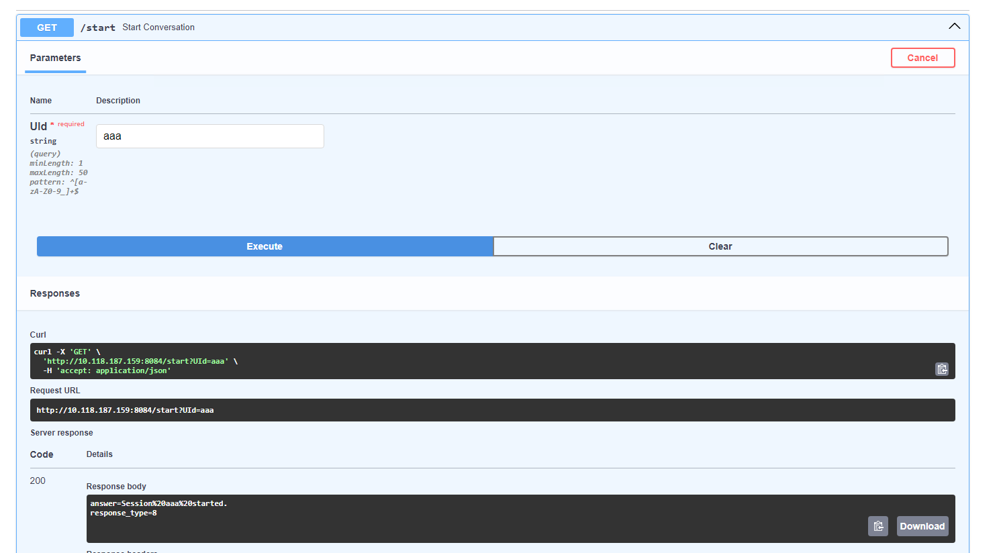

# Replica Azure

**INTRODUCCIÓN:** Microsoft y NTT Data hicieron un RAG con unos documentos de DGT y MUFACE usando ChatGPT y lo pusieron en Azure. A mí me pidieron hacer otro RAG con los mismos documentos de DGT y MUFACE. Está conectado a un servicio telefónico. La parte de teléfono, ASR y TTS la ha hecho Adrián.

[Noelia](noelia.nunez@externos.correo.gob.es ) es la que más sabe de la documentación de este proyecto.

Teléfonos:
- RAG de Microsoft y NTT Data: 919542810
- V0 de nuestro RAG: 910108930
- V1 (actual) del nuestro RAG: 910108905

## Código
- [Repo en lhf-labs, branch main](https://github.com/lhf-labs/rag_muface_dgt)
- [Zip en Gitlab](gitlab-ic.scae.redsara.es/060_lhf/rag_replica_azure)

### Resumen arquitectura 
El servicio de respuestas de DGT y MUFACE se compone de varios bloques, que son: 

- **Conector**: El conector es la parte del servicio que se encarga de recibir las transcripciones de ASR, generar la respuesta y enviarlas de vuelta al TTS. Es el punto de entrada principal. Tiene 3 endpoints: /start (para iniciar una conversación), /process_question (para mandar una pregunta) y /end (para terminar una conversación). 
- **Servicio RAG**: el servicio RAG se encarga de generar una respuesta cuando le llega una pregunta. Contiene a su vez la base de datos vectorial con la documentación de DGT y MUFACE y el modelo de “reranking” que hacen el paso de retrieval. 
- **Servicio SOLAR**: las preguntas que recibe el RAG, pasan por un filtro para determinar si pueden ser respondidas por el sistema; o si por el contrario no están relacionadas con la DGT y con MUFACE. Este servicio tiene el LLM que realiza ese filtro. 
- **Servicio Llama-3**: LLM principal  
- **Servicio de embeddings**: TEI de HuggingFace

En el archivo de configuración `src/config.json` se debe indicar la ruta a: la carpeta con los datos, el servicio llama3, servicio solar, servicio embeddings, y modelo reranker. Ejemplo de JSON:
```json
{
    "DATA_FILE_PATH": "/usr/src/app/src/data",
    "SERVER_LLAMA3": "http://10.118.187.159:8080",
    "SERVER_SOLAR": "http://10.118.187.161:8082",
    "SERVER_EMBEDDINGS": "http://10.118.187.160:8001",
    "RERANKER_MODEL_PATH": "/data/models/rerankers/bge-reranker-large",
    "EMBEDDINGS_MODEL_PATH": "/data/models/embeddings/bge-m3",
    "OPENAI_API_KEY": "sk-xxxxxxxxxxxxxxxxxxxxxxxxxxxxxxxxxxxxxxxx",
    "NUM_RETRIEVES_BM25": "10",
    "NUM_RETRIEVES_EMBEDDING": "10",
    "MAX_TOKENS_MAIN": "300",
    "LOGGING_MODE": "DEBUG"
}

```


**Arquitectura del RAG**


**Arquitectura del conector**


### Despliegue
**Preparación**:
1. Necesitas desplegar los LLMs y Text Embeddings Inference a los que apunta tu archivo de configuración.
```bash
# SOLAR con llamacpp
mkdir -p /data/models
cd /data/models
sudo wget https://huggingface.co/TheBloke/SOLAR-10.7B-Instruct-v1.0-GGUF/resolve/main/solar-10.7b-instruct-v1.0.Q8_0.gguf 
sudo docker run -v /mnt/sdc1/models:/MODELS -p 8082:8082 -e MODEL=solar-10.7b-instruct-v1.0.Q8_0.gguf -e PORT=8082 -e CTX=4096 --privileged --gpus all llamacpp_service # imagen llamacpp de Rafa

# Llama3 con vLLM 
cd /data/models 
git clone https://huggingface.co/meta-llama/Meta-Llama-3-8B-Instruct
cd /home/admin/
git clone https://github.com/lhf-labs/sgad.git # repo sgad del playground 
cd sgad/services/vLLM 
sudo ./deploy_vLLM.sh 0 /data/models/vLLM_models/ /root/.cache/huggingface 8000 vllm/vllm-openai:v0.4.2 NousResearch/Meta-Llama-3-8B-Instruct 

# TEI
mkdir –p /data/models/embeddings 
cd /data/models/embeddings 
git clone https://huggingface.co/BAAI/bge-m3 
docker run -d --privileged --gpus all -p 8001:80 -v /data/models/embeddings/bge-m3/:/model ghcr.io/huggingface/text-embeddings-inference:1.2 --model-id /model 
```

2. Necesitas descargarte el reranker y ponerlo en la ruta que indicas en el archivo de configuración
```bash
mkdir -p /data/models/rerankers 
cd /data/models/rerankers 
git clone https://huggingface.co/BAAI/bge-reranker-large 
```

**Despliegue**: 
Está descrito en el README del repo:
1. Despliegue del RAG (docker): 
```bash
cd rag_muface_dgt

docker build -t rag_muface_dgt_v2 -f core/Dockerfile .

docker run --restart unless-stopped -t --privileged --gpus all \
-v /home/admin/rag_muface_dgt/src/config.json:/usr/src/app/src/config.json \
-v /home/admin/rag_muface_dgt/data:/usr/src/app/src/data \
-v /home/admin/rag_muface_dgt/logs:/usr/src/app/logs \
-v /data/models/rerankers/bge-reranker-large:/data/models/rerankers/bge-reranker-large \
-v /data/models/embeddings/bge-m3:/data/models/embeddings/bge-m3 \
-p 8123:8123 \
-e PORT=8123 rag_muface_dgt_v2
```
Nota: En el archivo de configuración `src/config.json` se debe indicar la ruta a: la carpeta con los datos, el servicio llama3, servicio solar, servicio embeddings, y modelo reranker.

2. Despliegue del conector:
```bash
cd connectors
uvicorn connectors.main:app --host 0.0.0.0 --port 8084
```

### Diagnóstico

**Para probar que el RAG funciona:**

1. Prueba rápida en Python
```python

import requests
data = {"question": "Qué es MUFACE?"}
response = requests.post("http://localhost:8123/query", json=data)
print(response.text)
```

2. Pytest: [script](https://github.com/lhf-labs/rag_muface_dgt/blob/main/tests/test_rag.py)


**Para probar que el conector funciona:**

1. Se puede probar con Fast API: Abrir 10.118.187.159:8084/docs


2. Prueba rápida en Python:
```python
import requests
base_url = "http://localhost:8084"
session_id = "session123"

response = requests.get(f"{base_url}/start", params={"UId": session_id})
print(response.text)

response = requests.get(f"{base_url}/process_question", 
params={"UId": session_id}, "user_question": "Qué es MUFACE?")
print(response.text)

response = requests.get(f"{base_url}/end", params={"UId": session_id})
print(response.text)
```

3. Hay un script para probar rápidamente muchas funcionalidades: [script](https://github.com/lhf-labs/rag_muface_dgt/blob/main/connectors/tests/quick_test.py)

4. Pytest: [script](https://github.com/lhf-labs/rag_muface_dgt/blob/main/connectors/tests/test_connector.py)

## Datos
Los datos nos los pasó JC. Hubo que procesarlos muchas veces según íbamos encontrando fallos, cosas que el LLM no entendía bien, etc. 

- [Datos originales en sharepoint](https://colaboraage-my.sharepoint.com/:f:/r/personal/josecarlos_martinez_correo_gob_es/Documents/Documentaci%C3%B3n%20Servicio%20060/LHF-VF/Doc%20Proyectos%20LHF/Despliegue%20de%20modelo%20convesacional%20vocal%20muface-DGT/Documentos%20maestros?csf=1&web=1&e=Y2hAeA)
- [Datos procesados en gitlab](https://gitlab-ic.scae.redsara.es/060_lhf/rag_replica_azure/-/blob/main/KB_RAG_Azure.csv?ref_type=heads)

## Evaluación
Ha habido muchas rondas de evaluación. Quedan dos rondas finales, una usando Llama-3-8B-Instruct y otra con Llama-3-70B-Instruct.
Link a los Excel con las evaluaciones:
- [Llama-3-8B-Instruct](https://colaboraage-my.sharepoint.com/:x:/r/personal/josecarlos_martinez_correo_gob_es/Documents/Documentaci%C3%B3n%20Servicio%20060/LHF-VF/Doc%20Proyectos%20LHF/Despliegue%20de%20modelo%20convesacional%20vocal%20muface-DGT/Versi%C3%B3n%20LHF/Otros%20documentos/Comparativa_voz_ChatGPT_Llama3%20(v.2)%2020240903.xlsx?d=w410c28a0ebf24146867a4d34c0ac5ecb&csf=1&web=1&e=nIrO9N)
- [Llama-3-70B-Instruct](https://colaboraage-my.sharepoint.com/:x:/r/personal/josecarlos_martinez_correo_gob_es/Documents/Documentaci%C3%B3n%20Servicio%20060/LHF-VF/Doc%20Proyectos%20LHF/Despliegue%20de%20modelo%20convesacional%20vocal%20muface-DGT/Versi%C3%B3n%20LHF/Otros%20documentos/Evaluacion%20voz%2020240925%20Llama70B.xlsx?d=wed70208dab3a461d874e2d7375c7034e&csf=1&web=1&e=yO8s4G)

Además, un resumen de la evaluación que incluye tiempos de latencia está en:
- [una presentación que le hicimos a SGAD](https://colaboraage-my.sharepoint.com/:p:/r/personal/josecarlos_martinez_correo_gob_es/Documents/Documentaci%C3%B3n%20Servicio%20060/LHF-VF/Doc%20Proyectos%20LHF/Despliegue%20de%20modelo%20convesacional%20vocal%20muface-DGT/Versi%C3%B3n%20LHF/Otros%20documentos/Comparativa%20voz%20ChatGPT_Llama3%20-%20an%C3%A1lisis.pptx?d=wfc2ddf558c5c4e97a0cb4814caf4cc98&csf=1&web=1&e=EIFDOY)
- [documentación ENT de SGAD](https://colaboraage-my.sharepoint.com/:w:/r/personal/josecarlos_martinez_correo_gob_es/Documents/Documentaci%C3%B3n%20Servicio%20060/LHF-VF/Doc%20Proyectos%20LHF/Despliegue%20de%20modelo%20convesacional%20vocal%20muface-DGT/Versi%C3%B3n%20LHF/18102024_ENT_Modelo%20Conversacional%20MUFACE-DGT%20v0.docx?d=we5b9feec042245db86b8b071c8981d79&csf=1&web=1&e=7HIlui)


## Documentación 
- [Carpeta en SharePoint](https://colaboraage-my.sharepoint.com/:f:/r/personal/josecarlos_martinez_correo_gob_es/Documents/Documentaci%C3%B3n%20Servicio%20060/LHF-VF/Doc%20Proyectos%20LHF/Despliegue%20de%20modelo%20convesacional%20vocal%20muface-DGT/Versi%C3%B3n%20LHF?csf=1&web=1&e=J9grIl)
- [Documentación de la API en sharepoint](https://colaboraage-my.sharepoint.com/:w:/r/personal/josecarlos_martinez_correo_gob_es/Documents/Documentaci%C3%B3n%20Servicio%20060/LHF-VF/Doc%20Proyectos%20LHF/Despliegue%20de%20modelo%20convesacional%20vocal%20muface-DGT/Versi%C3%B3n%20LHF/Otros%20documentos/Documentaci%C3%B3n%20de%20la%20API%20RAG%20Replica%20Azure.docx?d=wd5e02b04e5e84622af29fcafb36bf0f1&csf=1&web=1&e=qxzdYZ)
- Documentación formal de SGAD: [DST](https://colaboraage-my.sharepoint.com/:w:/r/personal/josecarlos_martinez_correo_gob_es/Documents/Documentaci%C3%B3n%20Servicio%20060/LHF-VF/Doc%20Proyectos%20LHF/Despliegue%20de%20modelo%20convesacional%20vocal%20muface-DGT/Versi%C3%B3n%20LHF/18102024_DST_Modelo%20conversacional%20MUFACE-DGT%20v0.docx?d=we66c0715506c4ad7b7237deafce3a793&csf=1&web=1&e=PLspT9) y [ENT](https://colaboraage-my.sharepoint.com/:w:/r/personal/josecarlos_martinez_correo_gob_es/Documents/Documentaci%C3%B3n%20Servicio%20060/LHF-VF/Doc%20Proyectos%20LHF/Despliegue%20de%20modelo%20convesacional%20vocal%20muface-DGT/Versi%C3%B3n%20LHF/18102024_ENT_Modelo%20Conversacional%20MUFACE-DGT%20v0.docx?d=we5b9feec042245db86b8b071c8981d79&csf=1&web=1&e=7HIlui)
- [Guía de lo que puedes hacer](https://colaboraage-my.sharepoint.com/:w:/r/personal/josecarlos_martinez_correo_gob_es/Documents/Documentaci%C3%B3n%20Servicio%20060/LHF-VF/Doc%20Proyectos%20LHF/Despliegue%20de%20modelo%20convesacional%20vocal%20muface-DGT/Versi%C3%B3n%20LHF/Otros%20documentos/Demo%20guiada%20de%20la%20r%C3%A9plica%20de%20Azure.docx?d=w084033f351764c33bc63e54c955a1d61&csf=1&web=1&e=dWnrMI)
- [Protocolo de evaluación](https://colaboraage-my.sharepoint.com/:w:/r/personal/josecarlos_martinez_correo_gob_es/Documents/Documentaci%C3%B3n%20Servicio%20060/LHF-VF/Doc%20Proyectos%20LHF/Despliegue%20de%20modelo%20convesacional%20vocal%20muface-DGT/Versi%C3%B3n%20LHF/Otros%20documentos/Gu%C3%ADa%20de%20evaluaci%C3%B3n%20del%20sistema%20de%20preguntas%20y%20respuesta%20de%20DGT%20y%20MUFACE.docx?d=w51064ba408c14a55a846b3d0843ecf53&csf=1&web=1&e=etu3kR)

## Uso actual
Actualmente:
- el conector está desplegado en 159:8084 (screen session)
- el docker con el RAG está desplegado en 159:8123 (docker)
- el sistema telefónico de Adrián está apuntando al conector en 159:8084

## Otros
NA

